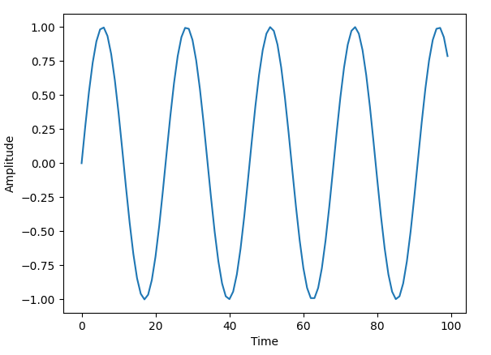

# img2wav
Convert pixel data to a wav file

# Usage
```sh
./img2wav 96000.0 2.0 in.jpg out.wav
```
 


# Building
```sh
mkdir build
cd build
cmake ..
```

# How it works
## Generating frequencies
A single sine wave of a given frequency over the interval t can be generated as follows:

$f(t) = A * sin(2\pi\frac{f_{c}}{f_{s}}t)$

where A is the ampltiude of the wave, $f_{c}$ is the desired frequency and $f_{s}$ is the sample rate.

For instance an A440 note at 96000hz is:
$f(t) = sin(2\pi\frac{440}{96000}t)$

This generates the amplitude over time graph:



And the corresponding spectrogram (frequency over time)


Notice how we have just one frequency existing at 440Hz.

We can generate multiple frequencies in the spectrogram easily:

$f(t) = \sum A * sin(2\pi\frac{f_{c}}{f_{s}}t)$

So to generate a 440Hz, 1200hz and 765hz wave at 96000hz:

$f(t) = sin(2\pi\frac{440}{96000}t) + sin(2\pi\frac{1200}{96000}t) + sin(2\pi\frac{765}{96000}t)$

## Preparing the image
Now that we know how to generate frequencies, we need to determine which frequencies to draw and how much of each should exist. To do this we create a heatmap by gray scaling an image and mapping the [0, 255] color value to an amplitude (A) in [0.01, 0.1].
Images usually contain 3 color values per pixel. In order to generate a heat map for our image we'll convert these 3 color values to a single color using the gray scale  [Luma](https://en.wikipedia.org/wiki/Luma_%28video%29#Rec._601_luma_versus_Rec._709_luma_coefficients) algorithm.
```
pixels[y][x] = r * 0.299 + g * 0.587 + b * 0.114;
```
 

## Transmission length
Once we have our pixel data prepared we need to determine how large the image should be.

The height of our image is going to be constrained within the frequencies displayed in our spectrogram. And the width will be evenly spread out over however many seconds we want to transmit the data for. Here's some code to explain this.

```py
time_s = 2                              # length of image in seconds
max_height = 96000                      # spectrogram height in hz
scale = max_height / height             # linearly scale our frequencies
target = (sample_rate * time_s) / width # width in time for each pixel
for x in width:
    for y in height:
        heat = map(pixels[y][x], 0, 255, 0.01, 0.1) # [0, 255] -> [0.01, 0.1]
        t = 0
        while (t < target):
            freq = y * scale # or (height - y) * scale to flip the image upside down
            output += heat * sin(2 * pi * (freq / sample_rate) * t)
            t += 1
```

## Normalization
Audio data is meant to be within the range of [-1, 1] and our process of summing frequencies may put us out of this range. A quick and dirty way of normalizing the input is to divide the audio data by the absolute maximum value.
```py
def normalize(data):
    return data / np.max(data)
```

## Displaying the spectrogram
A simple python script can generate a spectrogram from our audio files
```py
import matplotlib.pyplot as plt
from scipy import signal
from scipy.io import wavfile

sample_rate, samples = wavfile.read("out.wav")
frequencies, times, spectrogram = signal.spectrogram(samples, sample_rate)

plt.pcolormesh(times, frequencies, spectrogram)
plt.imshow(spectrogram)
plt.ylabel("Frequency [Hz]")
plt.xlabel("Time [sec]")
plt.show()
```
